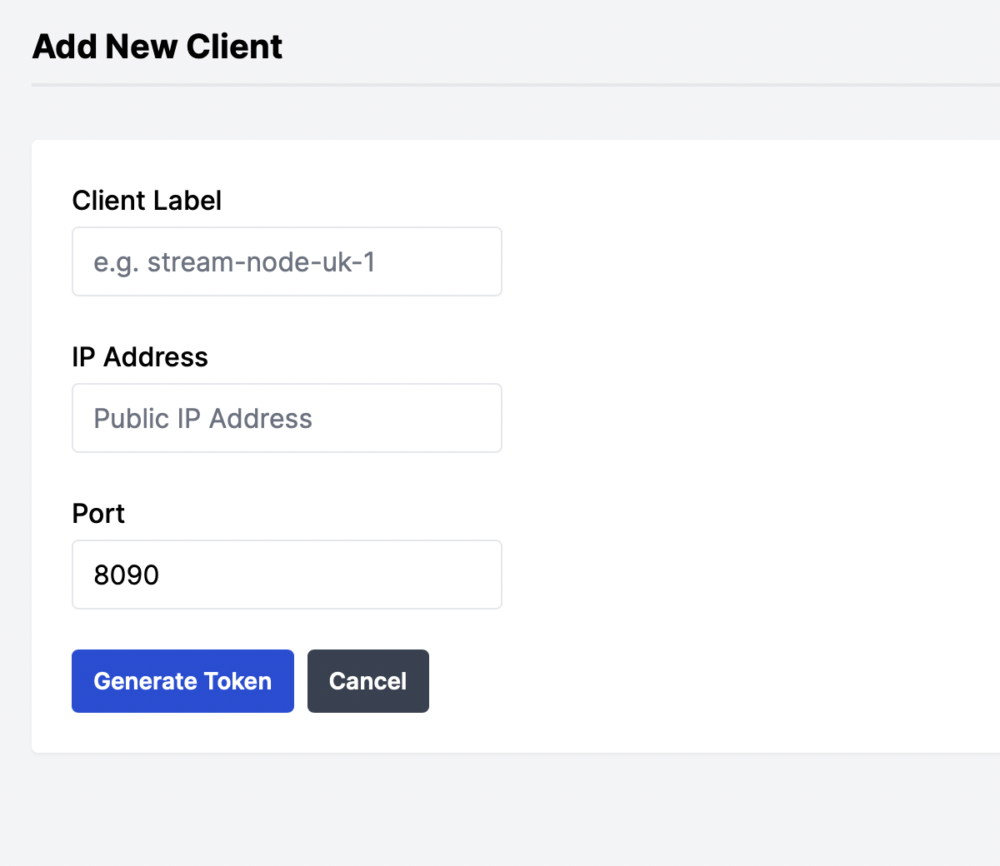

# Managing Clients

## Creating a new client 

### Install Requirements
This guide assumes you are running Ubuntu Linux, other distros may be supported but they have not been tested

Prior to running the upvideo Docker client image, please ensure the following requirements are met

- A Docker engine is installed and you have connectivity to the internet 
    - If you need to install Docker, see [installing Docker for Ubuntu](https://docs.docker.com/engine/install/ubuntu/)

### Adding a client 

Navigate to the 'clients' page on the dashboard

<figure markdown>
  { width="300" }
  <figcaption>Clients > Add Client</figcaption>
</figure>

- Provide a label for the client. Note, this will also be exposed as a Prometheus label for any inputs or outputs provisioned on this client to enable easy grouping of services via location

- Provide an IP address (this must be the publicly accessible)
    - This IP is also the value which will be presented for any input URIs

- The default port for upvideo &rarr; client communication is 8090/tcp. If you would like to use a different port, please overwrite the default value

Once all the required data is provided, pressing *Generate Token* will provide you with a Docker 'run' command to execute on your server. This will complete the registration process and your client will be ready to use. 

!!! note 
    The token is unique to this client and expires within an hour if it is not used

!!! warning
    The Docker 'run' command includes a volume mapping for the Docker socket (/var/run/docker.sock) which enables the upvideo client to provision and remove other upvideo containers (inputs, outputs and MPEG-TS monitoring containers), without this the upvideo client container cannot function

### Updating a client

There may be situations where you wish to update the IP address or port that the client is reachable on 

This is possible in the dashboard from the clients page under the 'actions' column for the specific client you wish to update

Label changes will be reflected in the dashboard instantly, and on Prometheus for any future inputs or outputs, it will not be reflected on existing inputs or outputs in Prometheus unless they are also reprovisioned, or if the server is restarted

#### IP Address Updates
The new IP will not be reflected on existing input URIs unless the input is reprovisioned, or if the server is restarted

#### Port Updates
Changing the port also requires you to update the port parameter for the client Docker container, this is quite a manual process as you need to re-run the Docker container with the new Port value mapped to the default container port value of 8090/tcp while retaining all the other Docker run parameters, such as environment variables for the token and volume mappings

### Removing a client

Navigate to the 'clients' page on the dashboard

Under the 'actions' column of the table, press the trash-can button which will prompt for confirmation you wish to remove the client

!!! note
    Clients cannot be removed until any inputs or outputs configured in that location have been deleted

!!! danger 
    Once the client has been removed in the dashboard, the container running on your server will also be stopped and removed too. It is not possible to recover removed clients!