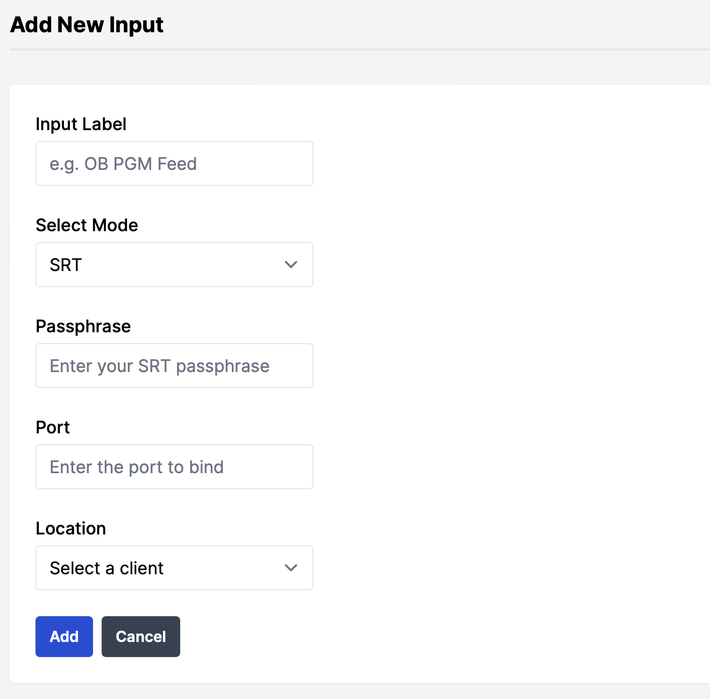

# Managing Inputs

## Creating a new input
Once you have a client to provision services on (see [ managing clients](managing_clients.md)) then navigate to the 'inputs' page on the dashboard

<figure markdown>
  { width="300" }
  <figcaption>Clients > Add Input</figcaption>
</figure>

- Service Label
- Select Mode (at time of writing, only SRT listeners are supported)
- Passphrase (currently always required for SRT listeners, min 10 characters)
- Port to bind to on the client
- Select a client location to provision the input on

Once the input is added, it will be provisioned on the client location. The first time you deploy an input, it may take more time to provision as both the input container image, and the MPEG-TS container are pulled onto your client 

## Updating an input

### Non service affecting updates
- Service Label

!!! note
    Updating the service label will not take effect on the Prometheus metric labels until the input has been reprovisioned (see below 'service affecting updates') or if the server is restarted 

### Service affecting updates

!!! warning
    The following changes will cause the input to be reprovisioned on the client server. This will cause an impact to any existing stream to the input

- Input Mode
- Passphrase
- Port Binds
- Client Location

## Removing an input

Navigate to the 'inputs' page on the dashboard

On the input you wish to remove, press the trash-can button which will prompt for confirmation you wish to remove the input

!!! note 
    It is not possible to remove an input until all the outputs using the input as a source have also been removed or updated with a new input source

!!! danger 
    Once the input has been removed in the dashboard, the container running on your server will also be stopped and removed too. It is not possible to recover removed inputs!
