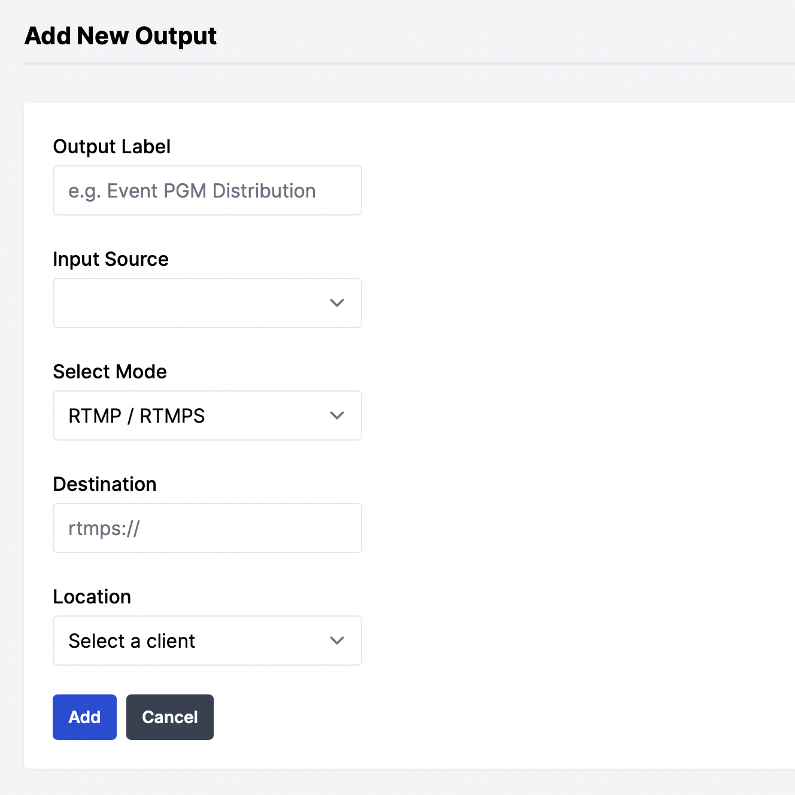

# Managing Outputs

## Creating a new output
Once you have a client to provision services on (see [ managing clients](managing_clients.md)) then navigate to the 'outputs' page on the dashboard

<figure markdown>
  { width="300" }
  <figcaption>Clients > Add Output</figcaption>
</figure>

- Service Label
- Input Source
- Select Mode (at time of writing, only RTMP or HLS Push outputs are supported)
- Destination URI (*for example:* rtmp://a.rtmp.youtube.com/live2/replace_with_stream_key)
- Select a client location to provision the output on

Once the output is added, it will be provisioned on the client location. The first time you deploy an output, it may take more time to provision as the output container image is pulled onto your client 

## Updating an output

### Non service affecting updates
- Service Label

!!! note
    Updating the service label will not take effect on the Prometheus metric labels until the output has been reprovisioned (see below 'service affecting updates') or if the server is restarted 

### Service affecting updates

!!! warning
    The following changes will cause the output to be reprovisioned on the client server. This will cause an impact to any existing stream to the output

- Input Source
- Output Mode
- Destination URI 
- Client Location

## Removing an output

Navigate to the 'outputs' page on the dashboard

On the output you wish to remove, press the trash-can button which will prompt for confirmation you wish to remove the output

!!! danger 
    Once the output has been removed in the dashboard, the container running on your server will also be stopped and removed too. It is not possible to recover removed outputs!
